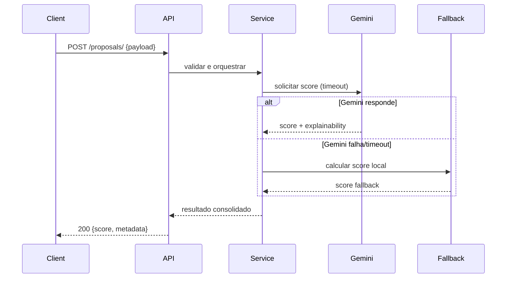
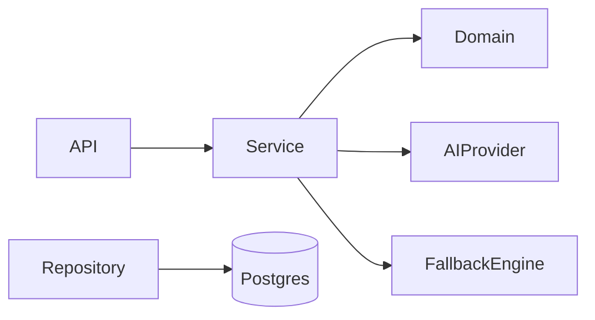

# CleanCredit API

Motor de Avaliação de Risco de Crédito — Produção-Ready MVP
Versão: v1.0.0

---

## Visão Geral

O **CleanCredit API** é um motor de avaliação de risco de crédito projetado para fins acadêmicos e portfólio técnico, desenvolvido segundo princípios de Clean Architecture e Domain-Driven Design (DDD). Seu objetivo é fornecer um serviço resiliente que combine análise baseada em IA com um mecanismo de fallback local determinístico para garantir continuidade operacional e auditabilidade.

Público-alvo: avaliadores acadêmicos, arquitetos corporativos e times técnicos de instituições financeiras.

---

## Proposta de Valor — Risco e Resiliência

- Risco: entrega de scores explicáveis e rastreáveis para decisões de crédito iniciais, com logs e metadados para auditoria.
- Resiliência: comportamento defensivo com fallback local, circuit-breakers e timeouts nas chamadas à IA externa.
- Compliance-friendly: design pensado para rastreabilidade, testes de regras e possibilidade de inspeção humana.

---

## Tech Stack (detalhado)

- Linguagem: Python 3.11+
- Framework Web: FastAPI (ASGI)
- Servidor ASGI: Uvicorn
- Modelagem / Validação: Pydantic / SQLModel (ou SQLAlchemy + Pydantic)
- Persistência: PostgreSQL (produção) / SQLite (dev)
- Migrações: Alembic
- IA: Integração com **Google Gemini** (gemini-1.5-flash) via camada de Adapters
- Testes / Qualidade: pytest, coverage, mypy, ruff, black
- Observabilidade: Prometheus + Grafana (opcional), Sentry (opcional)
- Contêineres: Docker, docker-compose

---

## Arquitetura

Princípios principais:

- Dependências direcionadas para dentro — camadas internas não dependem das externas.
- Ports & Adapters: interfaces e adaptadores para isolar infraestrutura.
- Domain-first: entidades e políticas no centro do sistema.

Camadas:

- `api`: rotas FastAPI, autenticação e validação.
- `services` / `application`: orquestração de casos de uso e fluxos.
- `domain`: entidades, value objects e regras de negócio puras.
- `repositories` / `infra`: persistência e integrações externas (IA, caches).
- `adapters`: implementações concretas de gateways e clients.

Exemplo de diagrama (Mermaid):

```mermaid
graph TD
  A[Client HTTP] -->|REST| B(API Layer)
  B --> C[Service Layer]
  C --> D[Domain: Use Cases]
  D --> E[Repository Interface]
  E --> F[Repository Implementation (Postgres)]
  C --> G[AI Provider Port]
  G --> H[Gemini Adapter]
  C --> I[Fallback Rules Engine]
  style I fill:#f9f,stroke:#333,stroke-width:1px
```

Sequência (consulta de score):



---

## Estrutura de Pastas (exemplo)

```
.
├─ app/
│  ├─ api/              # Endpoints e DTOs (ProposalCreate, ProposalStatusUpdate)
│  ├─ services/         # Lógica de Orquestração (ProposalService)
│  ├─ models/           # Entidades e Regras de Negócio (Proposal)
│  ├─ repositories/     # Persistência (InMemoryProposalRepository)
│  ├─ adapters/         # clients externos (AI, db, cache)
│  └─ main.py           # ponto de entrada ASGI
├─ migrations/
├─ tests/
├─ Makefile            # Automação de workflow
├─ requirements.txt
└─ README.md
```

---

## Guia de Instalação (Reprodução Local)

1. **Preparar Ambiente e Dependências**:

```bash
python3 -m venv .venv
source .venv/bin/activate
make install
```

Windows (PowerShell):

```powershell
python -m venv .venv
.venv\Scripts\Activate.ps1
```

2. Instalar dependências

```bash
pip install -r requirements.txt
```

Sugestão inicial de `requirements.txt`:

```
fastapi
uvicorn[standard]
pydantic
sqlmodel
alembic
python-dotenv
httpx
pytest
coverage
black
ruff
mypy
```

3. Arquivo de ambiente (`.env`)

Crie um `.env` na raiz com variáveis mínimas (exemplo):

```
# Banco
DATABASE_URL=sqlite:///./dev.db

# AI provider (Google Gemini)
GEMINI_API_KEY=your_gemini_key_here
AI_PROVIDER_URL=https://generativelanguage.googleapis.com/v1beta
AI_MODEL_NAME=gemini-1.5-flash

# App
FASTAPI_HOST=0.0.0.0
FASTAPI_PORT=8001
LOG_LEVEL=INFO

# Flags
ENABLE_AI=true
FALLBACK_RULES_PATH=./config/fallback_rules.yaml
```

4. Executar migrações (se aplicável)

```bash
alembic upgrade head
```

5. Rodar localmente

```bash
make run
```

6. Endpoints de saúde e docs

- Swagger UI: `GET /docs`
- ReDoc: `GET /redoc`
- Health: `GET /health`

---

## Execução e Testes

- Rodar testes:

```bash
pytest -q
```

- Cobertura:

```bash
coverage run -m pytest && coverage html
```

- Lint & tipo:

```bash
ruff check .
mypy app
black --check .
```

---

## Fallback Rules & Governance

- Regras locais devem ser codificadas no `domain` como políticas puras e testáveis.
- Fallback deve ser ativado por feature flag (`ENABLE_AI=false` ou falha de provider).
- Logs e metadados do scoring (versão do modelo, prompt, probabilidades) devem ser persistidos para auditoria.

---

## Observabilidade e Resiliência

- Timeouts e circuit-breakers nas chamadas à IA (ex.: `httpx` com timeout + retry).
- Métricas expostas via `/metrics` para Prometheus.
- Erros capturados por Sentry com contexto do request e payload (sem PII sensível).

---

## Roadmap de Releases

- v0.1.0 — MVP mínimo
  - Endpoints básicos de scoring
  - Integração básica com provider de IA (mockável)
  - Fallback rules engine simples
  - Testes unitários essenciais
- v0.2.0 — Robustez
  - Circuit-breaker e timeouts configuráveis
  - Logging estruturado e métricas
  - Migrações DB e persistência de requests/scores
- v0.3.0 — Governança e auditoria
  - Rastreabilidade completa dos scores (metadata)
  - Painel básico de monitoramento
  - Documentação de segurança e privacidade
- v0.5.0 — Hardened
  - Melhorias em performance e caching
  - Testes de integração e contratos
  - Estratégia de deploy com containers
- v1.0.0 — Release Candidate → Produção
  - Políticas de segurança e revisão
  - Documentação final para avaliação/portfólio
  - Preparação para POC em contexto real (dados sintéticos)

---

## Segurança e Privacidade

- Nunca logar PII sensível em texto simples.
- Rotação de chaves e uso de vault em ambiente de produção.
- Validação e sanitização rígida de inputs.
- Políticas de retenção de dados e anonimização conforme regulamentos aplicáveis.

---

## Contribuição

- Fork → feature branch → PR com descrição técnica e evidências de testes.
- Padrões de código: `black`, `ruff` e `mypy` obrigatórios antes do merge.
- Documentar decisões arquiteturais importantes (ARC docs) em `docs/architecture`.

---

## Exemplos de Request (curl)

```bash
curl -X POST http://localhost:8001/proposals/ \
  -H "Content-Type: application/json" \
  -d '{
    "cpf": "52998224725",
    "full_name": "Wellington Melo",
    "monthly_income": 8500.00,
    "amount_requested": 15000.00
  }'
```

Resposta esperada (exemplo):
```
{
  "score": 0.72,
  "decision": "manual_review",
  "explainability": {
    "factors": [
      {"reason": "income", "impact": 0.3},
      {"reason": "age", "impact": -0.1}
    ],
    "source": "ai" // ou "fallback"
  },
  "metadata": {
    "model_version": "gpt-x.y",
    "request_id": "uuid",
    "timestamp": "..."
  }
}
```

---

## Deploy (Docker — recomendações)

- Fornecer `Dockerfile` e `docker-compose.yml` com variáveis sensíveis via secret store.
- Build multi-stage e execução via Uvicorn + Gunicorn (opcional) para produção.
- Healthchecks prontos para plataforma orquestradora (K8s, ECS).

---

## Documentação Técnica & Diagramas

- Incluir diagramas Mermaid no repositório em `docs/diagrams/`.

Exemplo (placeholder):



---

## Licença

- Escolha uma licença compatível com o objetivo (ex.: MIT para portfólio; consulte política institucional para uso em pesquisa).

---

## Contato / Autor

- Nome: Wellington Melo
- Papel: Arquiteto / Pesquisador — CleanCredit API
- Email: ton.melo.engenharia@gmail.com
- LinkedIn: https://www.linkedin.com/in/wellington-melo-401b68b4/

---

Obrigado. Este README serve como base para avaliação acadêmica e demonstração de competências em arquitetura e engenharia de software para ambientes financeiros.
